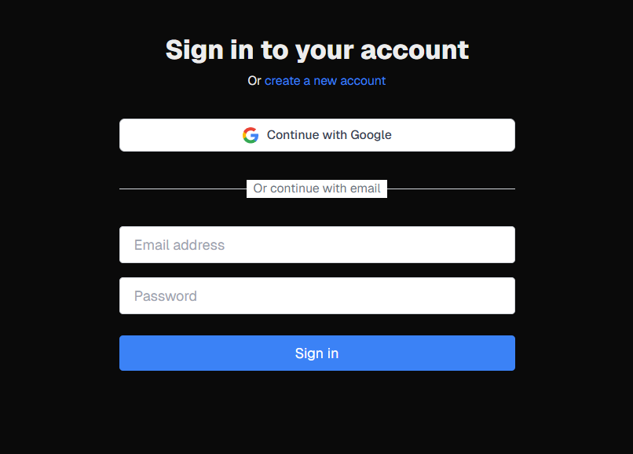

# Social login Google and Email Based Authentication using Better Auth, Next.js + Tailwind CSS


## Getting Started

clone the repository rename `envsample` to `.env` and add your Google OAuth credentials:
https://developers.google.com/identity/protocols/oauth2

added redirect and authredirect urls in the google cloud console.

update the google oauth credentials in the .env file:
```bash
GOOGLE_CLIENT_ID="your-google-client-id"
GOOGLE_CLIENT_SECRET="your-google-client-secret"
```
Install the npm dependencies:
```bash
npm install
```
## Seed the database to create the tables.

```bash
npm run seed
```
## Start the development server.

```bash
npm run dev
# or
yarn dev
# or
pnpm dev
# or
bun dev
```

Open [http://localhost:3000](http://localhost:3000) with your browser to see the result.
